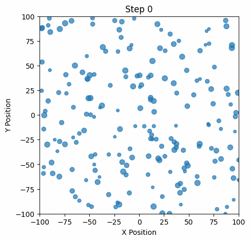

# MSSE 272 — Project 2: Lennard-Jones Metropolis Simulation

This project implements a 2D Monte Carlo simulation using the **Metropolis algorithm** with a **Lennard–Jones (LJ) potential**.  
It was completed as part of **CHEM 272: Python for Molecular Sciences** in the UC Berkeley **Master of Molecular Science & Software Engineering (MSSE)** program.

The project includes:

- A **C++ implementation** for fast simulation  
- A **Python implementation** for analysis and visualization  
- The original **scientific report** describing methods and results  
- A clean project structure suitable for employers and researchers  

---

## Project Overview

The goal of this assignment was to explore **particle interactions and thermodynamic sampling** using the LJ potential:

\[
\phi(r) = \frac{a}{r^{12}} - \frac{b}{r^6}
\]

The Metropolis algorithm is used to probabilistically accept/reject trial moves:

\[
P(\text{accept}) = \min\left(1, \exp[-\beta \Delta U]\right)
\]

Both **random-scan** and **all-at-once** update strategies are implemented.

---

## Repository Structure

```
msse272-project2-lj-metropolis/
│
├── README.md
├── CODE_STRUCTURE.md
├── requirements.txt
│
├── cpp/
│   └── sim.cpp
│
├── python/
│   ├── simulation.py
│   └── plot_results.py
│
├── report/
│   └── Project_2_Report.pdf
│
└── results/
    ├── energies.csv
    ├── accepted_moves.csv
    └── (plots generated by Python)
```
---

## Running the Code

### **C++ Version**

**Compile:**
```bash
cd cpp
g++ -O2 -std=c++17 sim.cpp -o sim
```

**Run:**
```bash
./sim
```

### **Python Version**

**Setup:**
```bash
pip install -r requirements.txt
```

**Run simulation:**
```bash
cd python
python simulation.py
```

**Generate plots:**
```bash
python python plot_results.py
```

---

## Output

The simulation produces:

- **CSV files** containing particle positions and energies
- **Plots** visualizing LJ energy, acceptance ratios, and particle distributions  
- **Output images** stored in `results/`

---



## Report

The full project write-up is provided in `report/Project_2_Report.pdf`

It includes:
- Background on the LJ potential
- Derivation of the Metropolis algorithm
- Implementation details
- Results and interpretation
- Discussion of model limitations

---